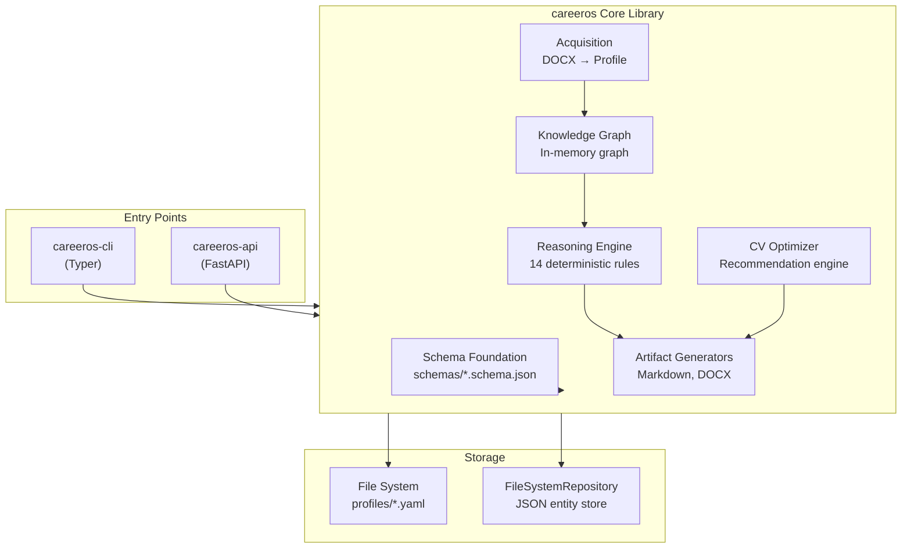

# 01 — System Overview

## High-Level Architecture

CareerOS is organized as a layered system with two top-level application entry points sharing a common core library.

## Subsystem Responsibilities

### Canonical Schema (`schemas/`, `careeros/schema_loader.py`, `careeros/validator.py`)

18 JSON Schema files (Draft 2020-12) define the canonical data model. Three foundational schemas (`common.schema.json`, `enums.schema.json`, `metadata.schema.json`) provide reusable definitions. The `profile.schema.json` aggregates all entity types into a single top-level document.

- **SchemaLoader** discovers and caches schema files from the filesystem
- **EntityValidator** validates entity dicts against schemas using `jsonschema` with `referencing`

### Canonical Profile (`careeros/profile_loader.py`)

Deserializes profile YAML/JSON files from disk with optional schema validation.

### Knowledge Graph (`careeros/knowledge/`)

Transforms a canonical profile dict into an in-memory property graph with 5 node types (person, experience, skill, education, organization) and 7 edge types. Provides query methods (skills by experience, organizations for skills, etc.). All construction is deterministic.

### Reasoning Engine (`careeros/reasoning/`)

Executes 14 deterministic rules (7 tenure, 7 experience) against a Knowledge Graph. Each rule produces `ReasoningResult` findings with typed values and confidence scores (all currently 1.0). Rules are registered in a `RuleRegistry` and executed in dependency order via topological sort. The engine provides two entry points:

- `run(graph, profile, params)` → `AnalysisModel` (accepts pre-built graph)
- `analyze(profile, params)` → `ReasoningReport` (builds graph internally)

An `EvidencePackageAssembler` transforms the raw results into a consumer-friendly `EvidencePackage` organized by section (experiences, skills, education, strengths, weaknesses, etc.).

### Artifact Generators (`careeros/generators/`)

Three generators registered via `GeneratorRegistry`:

| Generator | Artifact Types | Output |
|---|---|---|
| `MarkdownCVGenerator` | CV, RESUME | Markdown string |
| `DocxCVGenerator` | CV, RESUME | DOCX bytes |
| `MarkdownCoverLetterGenerator` | COVER_LETTER | Markdown string |

All generators accept an `ExportContract` (constructed by `ExportContractBuilder` from a profile and artifact ID) and produce output via the `ArtifactGenerator` protocol.

### Acquisition Pipeline (`careeros/acquisition/`)

End-to-end pipeline for ingesting source documents and producing canonical profiles:

1. `DocumentReader` — reads DOCX → raw text
2. `TextExtractor` — normalizes whitespace
3. `LLMExtractor` (Abstract) / `OpenAILLMExtractor` — calls LLM for structured extraction
4. `CanonicalProfileBuilder` — normalizes, deduplicates, assembles profile dict
5. Schema validation
6. `YamlWriter` — persists to YAML

### CV Optimizer (`careeros/optimizer.py`)

Analyzes a canonical profile and a CV artifact to recommend additions (skills, experiences, achievements, projects, education, certifications). Uses weighted keyword matching against job descriptions and target contexts.

### DOCX Renderer (`careeros/docx_renderer.py`)

Applies optimization recommendations to an existing DOCX CV file by inserting new items with evidence annotations (highlighted in blue).

### Entry Points

#### CLI (`careeros_cli/main.py`)

15 commands built with Typer + Rich, covering validation, schema inspection, artifact generation, optimization, profile acquisition, and analysis. Nearly all API functionality is mirrored in the CLI.

#### REST API (`api/main.py`)

20 endpoints built with FastAPI 1.0.0, covering health, version, schemas, validation, CRUD entity operations, profile management (import, list, get, delete), artifact generation, CV optimization, and profile analysis. Uses Pydantic models for request/response validation.

#### Frontend (`frontend/src/`, `frontend/dist/`)

A React 19 / Vite single-page application with TypeScript source code under `frontend/src/`. Built artifacts are output to `frontend/dist/`.
