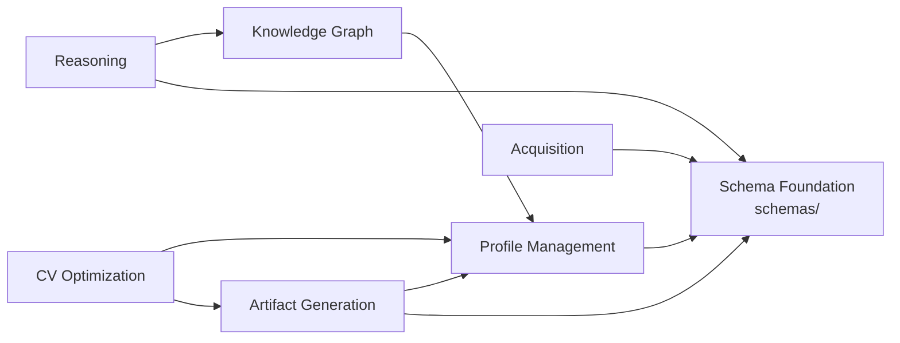

# 02 — Domain Map

## Current Domains

### 1. Schema Foundation

| Aspect | Description |
|---|---|
| **Purpose** | Define the canonical data model for all career entities |
| **Responsibilities** | Entity definition, structural validation, enumeration management |
| **Owned Models** | 18 JSON Schema files (`profile`, `skill`, `achievement`, `education`, `project`, `certification`, `company`, `job`, `application`, `interview`, `language`, `publication`, `event`, `note`, `document`, `metadata`, `common`, `enums`) |
| **Dependencies** | None (standalone JSON files) |
| **Package** | `schemas/` |

### 2. Profile Management

| Aspect | Description |
|---|---|
| **Purpose** | Load, validate, and persist canonical profiles |
| **Responsibilities** | YAML/JSON deserialization, schema validation, filesystem CRUD |
| **Owned Models** | `ProfileLoader`, `EntityValidator`, `SchemaLoader`, `FileSystemRepository`, `ValidationResult`, `EntityRecord` |
| **Dependencies** | Schema Foundation (`schemas/`) |
| **Key Files** | `careeros/profile_loader.py`, `careeros/schema_loader.py`, `careeros/validator.py`, `careeros/repository.py`, `careeros/models.py` |

### 3. Knowledge Graph

| Aspect | Description |
|---|---|
| **Purpose** | Transform canonical profiles into a queryable property graph |
| **Responsibilities** | Graph construction, entity queries, graph traversal |
| **Owned Models** | `KnowledgeGraph`, `KnowledgeGraphBuilder`, `GraphNode`, `GraphEdge` |
| **Dependencies** | Profile Management (takes profile dict as input) |
| **Package** | `careeros/knowledge/` |

### 4. Reasoning

| Aspect | Description |
|---|---|
| **Purpose** | Execute deterministic analytical rules over profile data |
| **Responsibilities** | Rule registration and execution, finding aggregation, evidence packaging |
| **Owned Models** | `ReasoningEngine`, `RuleRegistry`, `Rule`, `ReasoningResult`, `RuleContext`, `AnalysisModel`, `ReasoningReport`, `EvidencePackage`, `EvidencePackageAssembler` |
| **Dependencies** | Knowledge Graph (consumes graph), Schema Foundation (profile structure conventions) |
| **Package** | `careeros/reasoning/` |
| **Rule Count** | 14 rules (7 tenure, 7 experience), all deterministic |
| **Finding Types** | 21 finding types emitted across all rules |

### 5. Artifact Generation

| Aspect | Description |
|---|---|
| **Purpose** | Produce career artifacts from profile data |
| **Responsibilities** | Contract building, evidence selection, output rendering |
| **Owned Models** | `ExportContract`, `ExportContractBuilder`, `ExportSource`, `EvidenceSelector`, `GeneratorRegistry`, `MarkdownCVGenerator`, `DocxCVGenerator`, `MarkdownCoverLetterGenerator` |
| **Dependencies** | Profile Management (loads profiles), Schema Foundation (artifact schemas) |
| **Package** | `careeros/generators/`, `careeros/export_contract.py`, `careeros/evidence_selector.py` |

### 6. CV Optimization

| Aspect | Description |
|---|---|
| **Purpose** | Generate recommendations for improving CV artifacts |
| **Responsibilities** | Profile-artifact comparison, relevance scoring, DOCX rendering |
| **Owned Models** | `CVOptimizer`, `Recommendation`, `CVDocumentRenderer` |
| **Dependencies** | Profile Management, Artifact Generation (profile data, artifact schemas) |
| **Key Files** | `careeros/optimizer.py`, `careeros/docx_renderer.py` |

### 7. Acquisition (Knowledge Ingestion)

| Aspect | Description |
|---|---|
| **Purpose** | Ingest source documents and construct canonical profiles |
| **Responsibilities** | Document parsing, text extraction, LLM-based structured extraction, normalization, deduplication, YAML persistence |
| **Owned Models** | `AcquisitionPipeline`, `DocumentReader`, `TextExtractor`, `LLMExtractor`, `OpenAILLMExtractor`, `CanonicalProfileBuilder`, `YamlWriter`, `PersonData`, `ExperienceData`, `SkillData`, `EducationData`, `ExtractionResult`, `BuilderRegistry`, `PersonBuilder`, `ExperienceBuilder`, `SkillBuilder`, `EducationBuilder` |
| **Dependencies** | Schema Foundation (validates output), Profile Management (uses schema loader) |
| **Package** | `careeros/acquisition/` |

### 8. Delivery Interfaces

| Aspect | Description |
|---|---|
| **Purpose** | Expose CareerOS capabilities to users |
| **Responsibilities** | CLI commands, REST endpoints, request/response handling |
| **Owned Models** | FastAPI app (14 endpoints), Typer app (13 commands), Pydantic request/response schemas |
| **Dependencies** | All core modules |
| **Location** | `careeros_cli/main.py`, `api/main.py` |
| **Frontend Location** | `frontend/dist/` (built artifact, no source) |

## Domain Dependency Graph

## Possible Future Domains

The following domains appear in the existing documentation or codebase as planned but are not yet implemented:

| Domain | Evidence | Status |
|---|---|---|
| **Job Search Management** | `job.schema.json`, `application.schema.json`, `interview.schema.json` exist | Schema defined, no implementation |
| **Target Context Matching** | `targetContexts` exist in `profile.schema.json`; `EvidenceSelector` does basic filtering | Partial — schema exists, but no matching engine |
| **Human Review Workflow** | `ReviewHookFn` type in `acquisition/pipeline.py` | Placeholder — passes through with no-op |
| **Provider Hints** | Mentioned in `evidence-package.md` as extension | Not implemented |
| **Custom Rules Namespace** | Mentioned in `evidence-package.md` | Not implemented |
| **PDF Generation** | Not implemented — only Markdown and DOCX exist | Not implemented |
| **LLM-Powered Artifact Generation** | Architecture envisions AI consuming `EvidencePackage` | Not implemented; current generators use templates |
