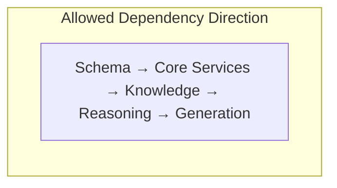

# 03 — Module Dependencies

## Package Structure

The CareerOS codebase contains two top-level application packages and one core library package, all in a flat repository layout.

```
career-OS/
├── api/                  # FastAPI application
├── careeros/             # Core library
│   ├── acquisition/      #   Data ingestion
│   │   └── builders/     #   Entity builders
│   ├── ai/               #   AI provider abstraction (openai/ollama/mock)
│   ├── generators/       #   Artifact generators
│   ├── interview/        #   Interview Intelligence module (M1.14)
│   ├── knowledge/        #   Knowledge graph
│   └── reasoning/        #   Reasoning engine
│       ├── rules/        #     Rule implementations
│       └── utils/        #     Shared utilities
├── careeros_cli/         # CLI application
├── schemas/              # JSON Schema files
├── tests/                # Test suite
└── frontend/dist/        # Built frontend artifact
```

## Package Dependency Map

```mermaid
graph TB
    subgraph External["External Dependencies"]
        Typer["typer"]
        Rich["rich"]
        PyYAML["PyYAML"]
        JS["jsonschema+referencing"]
        Docx["python-docx"]
    end

    subgraph Apps["Applications"]
        CLI["careeros_cli<br/>Typer app"]
        API["api<br/>FastAPI app"]
    end

    subgraph Core["careeros Core Library"]
        CL["careeros/__init__.py<br/>(Public API facade)"]

        subgraph Acquisition["Acquisition"]
            A_PIPELINE["acquisition/pipeline.py"]
            A_READER["acquisition/document_reader.py"]
            A_EXTRACTOR["acquisition/llm_extractor.py"]
            A_TEXT["acquisition/text_extractor.py"]
            A_BUILDER["acquisition/profile_builder.py"]
            A_BUILDERS["acquisition/builders/*.py"]
            A_YAML["acquisition/yaml_writer.py"]
            A_DATA["acquisition/person_data.py"]
            A_UTILS["acquisition/utils.py"]
        end

        subgraph CoreServices["Core Services"]
            SCHEMA_LOADER["schema_loader.py"]
            VALIDATOR["validator.py"]
            PROFILE_LOADER["profile_loader.py"]
            REPO["repository.py"]
            MODELS["models.py"]
            EXCEPTIONS["exceptions.py"]
        end

        subgraph Knowledge["Knowledge"]
            KG_BUILDER["knowledge/builder.py"]
            KG_MODELS["knowledge/models.py"]
        end

        subgraph Reasoning["Reasoning"]
            R_ENGINE["reasoning/engine.py"]
            R_REGISTRY["reasoning/registry.py"]
            R_MODELS["reasoning/models.py"]
            R_RULES["reasoning/rules/*.py"]
            R_UTILS["reasoning/utils/*.py"]
            R_ASSEMBLER["reasoning/assembler.py"]
        end

        subgraph Generation["Generation"]
            G_REGISTRY["generators/registry.py"]
            G_MD_CV["generators/markdown_cv.py"]
            G_MD_CL["generators/markdown_cover_letter.py"]
            G_DOCX["generators/docx_cv.py"]
            G_DOCX_UTILS["generators/docx_utils.py (M1.16)"]
            G_MD_PG["generators/markdown_preparation_guide.py (M1.16)"]
            G_DOCX_PG["generators/docx_preparation_guide.py (M1.16)"]
        end

        subgraph AI["AI Provider Abstraction"]
            AI_BASE["ai/base.py"]
            AI_FACTORY["ai/factory.py"]
            AI_OPENAI["ai/openai_provider.py"]
            AI_OLLAMA["ai/ollama_provider.py"]
            AI_MOCK["ai/mock_provider.py"]
        end

        subgraph Interview["Interview Intelligence (module)"]
            I_DOMAIN["interview/domain.py"]
            I_ENGINE["interview/engine.py"]
            I_TEMPLATES["interview/templates.py"]
            I_BUILDER["interview/question_builder.py"]
            I_COMP["interview/competency.py"]
        end

        EXPORT["export_contract.py"]
        EVIDENCE["evidence_selector.py"]
        OPT["optimizer.py"]
        PIPELINES["pipelines.py"]
        DOCX_RENDER["docx_renderer.py"]
    end

    subgraph Schemas["Validated Schemas"]
        SCHEMAS["schemas/*.schema.json"]
    end

    subgraph Tests["Tests"]
        TESTS["tests/*.py"]
    end

    %% External → App
    CLI --> Typer
    CLI --> Rich

    %% External → Core
    CL --> PyYAML
    CL --> JS
    CL --> Docx

    %% App → Core
    CLI --> CL
    API --> CL

    %% Core internal
    CL --> PROFILE_LOADER
    CL --> EXPORT
    CL --> EVIDENCE
    CL --> G_REGISTRY
    CL --> REPO
    CL --> PIPELINES
    CL --> OPT
    CL --> DOCX_RENDER
    CL --> A_PIPELINE

    PIPELINES --> PROFILE_LOADER
    PIPELINES --> EXPORT
    PIPELINES --> EVIDENCE
    PIPELINES --> G_REGISTRY

    EXPORT --> SCHEMA_LOADER
    EXPORT --> VALIDATOR
    EXPORT --> MODELS
    EXPORT --> EXCEPTIONS

    PROFILE_LOADER --> SCHEMA_LOADER
    PROFILE_LOADER --> VALIDATOR
    SCHEMA_LOADER --> SCHEMAS
    VALIDATOR --> SCHEMA_LOADER
    VALIDATOR --> MODELS
    REPO --> VALIDATOR
    REPO --> MODELS

    EVIDENCE --> EXPORT

    KG_BUILDER --> KG_MODELS

    R_ENGINE --> R_REGISTRY
    R_ENGINE --> R_MODELS
    R_ENGINE --> KG_BUILDER
    R_ENGINE --> KG_MODELS
    R_RULES --> R_MODELS
    R_RULES --> R_UTILS
    R_ASSEMBLER --> R_MODELS

    A_PIPELINE --> A_READER
    A_PIPELINE --> A_TEXT
    A_PIPELINE --> A_EXTRACTOR
    A_PIPELINE --> A_BUILDER
    A_PIPELINE --> A_YAML
    A_PIPELINE --> SCHEMA_LOADER
    A_PIPELINE --> VALIDATOR
    A_BUILDER --> A_BUILDERS
    A_EXTRACTOR --> A_DATA

    %% Core -> AI provider abstraction
    AI_OPENAI --> AI_BASE
    AI_OLLAMA --> AI_BASE
    AI_MOCK --> AI_BASE
    AI_FACTORY --> AI_OPENAI
    AI_FACTORY --> AI_OLLAMA
    AI_FACTORY --> AI_MOCK
    A_EXTRACTOR --> AI_BASE
    A_EXTRACTOR --> AI_FACTORY
    A_EXTRACTOR --> AI_OPENAI
    A_EXTRACTOR --> AI_OLLAMA
    G_MD_CV --> AI_BASE
    G_MD_CV --> AI_FACTORY

    %% Interview Intelligence → Core (module consumes Core only, ADR-005)
    I_ENGINE --> I_DOMAIN
    I_ENGINE --> I_TEMPLATES
    I_ENGINE --> I_BUILDER
    I_ENGINE --> I_COMP
    I_BUILDER --> I_DOMAIN
    I_COMP --> I_DOMAIN
    I_ENGINE --> KG_BUILDER
    I_ENGINE --> KG_MODELS
    I_COMP --> OPT

    G_MD_CV --> EXPORT
    G_MD_CL --> EXPORT
    G_MD_CL --> G_MD_CV
    G_DOCX --> EXPORT
    G_DOCX --> G_MD_CV
    G_REGISTRY --> Docx

    %% M1.16 — Interview Preparation Guide generators
    G_MD_PG --> EXPORT
    G_MD_PG --> I_DOMAIN
    G_DOCX_PG --> EXPORT
    G_DOCX_PG --> G_MD_PG
    G_DOCX_UTILS --> Docx
    G_DOCX --> G_DOCX_UTILS
    PIPELINES --> I_ENGINE

    OPT --> EXPORT
    DOCX_RENDER --> OPT
    DOCX_RENDER --> Docx

    TESTS --> CL
```



## Allowed Dependencies



The intended dependency flow is strict: schemas are leaf nodes, core services depend only on schemas, knowledge builds on core services, reasoning builds on knowledge, and generation builds on reasoning output.

## Current Violations and Deviations

### 1. Cyclic Dependency Risk: `export_contract.py` → `validator.py` → `schema_loader.py`

The `ExportContractBuilder` depends on `EntityValidator`, which depends on `SchemaLoader`, which depends on the filesystem schema directory. This is a one-way chain, but `schema_loader.py` imports from `exceptions.py` and `models.py` which are used by nearly all modules, creating a tightly-coupled common base.

**Status**: Acceptable — forms a stable foundation pattern, not a cycle.

### 2. Generator Dependency on MarkdownCVGenerator

Both `DocxCVGenerator` and `MarkdownCoverLetterGenerator` compose `MarkdownCVGenerator` internally, using its private helper methods (`_person_name`, `_education_label`, `_date_range`). These are imported via `from .markdown_cv import MarkdownCVGenerator` and accessed on instances.

**Risk**: If `MarkdownCVGenerator`'s internal helpers change, downstream generators break. Currently no shared utility module for rendering primitives.

### 3. Reasoning Engine Depends on KnowledgeGraphBuilder at Runtime

`ReasoningEngine.analyze()` imports and instantiates `KnowledgeGraphBuilder`. This is a runtime dependency introduced during consolidation (PKR-006.5). The original `run()` method accepts a pre-built graph — the two paths have different coupling levels.

### 4. LLM Access Was Embedded in Core Consumers

`OpenAILLMExtractor` and `MarkdownCVGenerator` previously made HTTP calls to vendor APIs directly, with duplicated request/error-handling code. **Resolved in M1.13 (ADR-006):** all vendor/HTTP code moved behind the `careeros/ai/` provider abstraction (`AIProvider.generate`); consumers depend only on the interface and the `create_ai_provider()` factory, and `httpx` is a declared dependency in `pyproject.toml`. See [ADR-006](../platform-beta/ADR-006-AI-Provider-Agnostic-Foundation.md).

### 5. Frontend Is a Build Artifact with No Source

The `frontend/dist/` directory contains compiled JavaScript/CSS. No `package.json` or source files exist in the repository. The frontend cannot be rebuilt from source without external project files.

## Architectural Risk Summary

| Risk | Severity | Description |
|---|---|---|---|
| LLM vendor coupling | ~~Medium~~ Low (M1.13) | All vendor/HTTP code isolated in `careeros/ai/` (ADR-006) |
| Implicit cross-generator coupling | ~~Low~~ Resolved (M1.16) | `docx_utils.py` extracted as the single source of truth for Markdown→DOCX rendering; `docx_cv.py` and `docx_letter.py` now delegate to it |
| Interview plan on ExportContract | Low | `ExportContract.interview_plan` typed via `TYPE_CHECKING` to avoid a Core→module runtime dependency; same pattern may apply to future module artifacts |
| Frontend source not in repo | Medium | Cannot modify or rebuild the frontend from this repository |
| Flat-layout package discovery | Low | `pyproject.toml` cannot use `pip install -e .` due to multiple top-level packages |
| No abstract graph interface | Low | `ReasoningEngine` depends on concrete `KnowledgeGraph` class |
