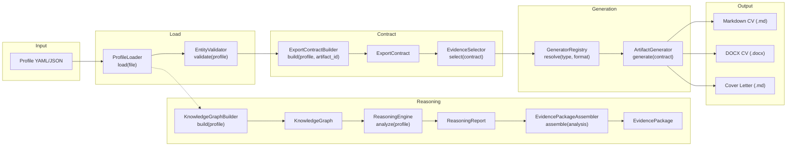
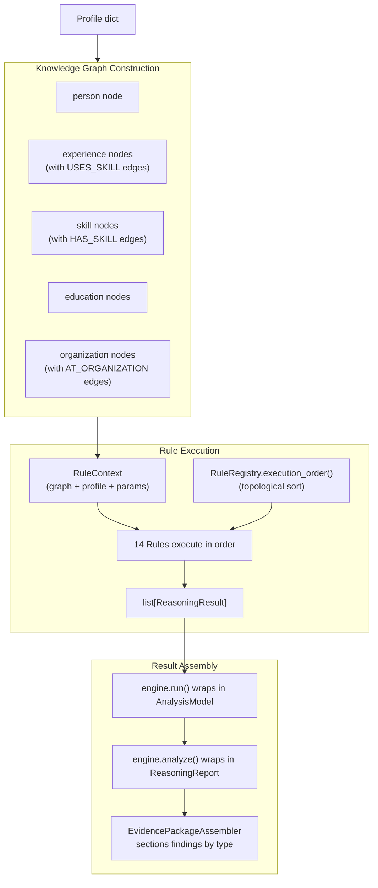
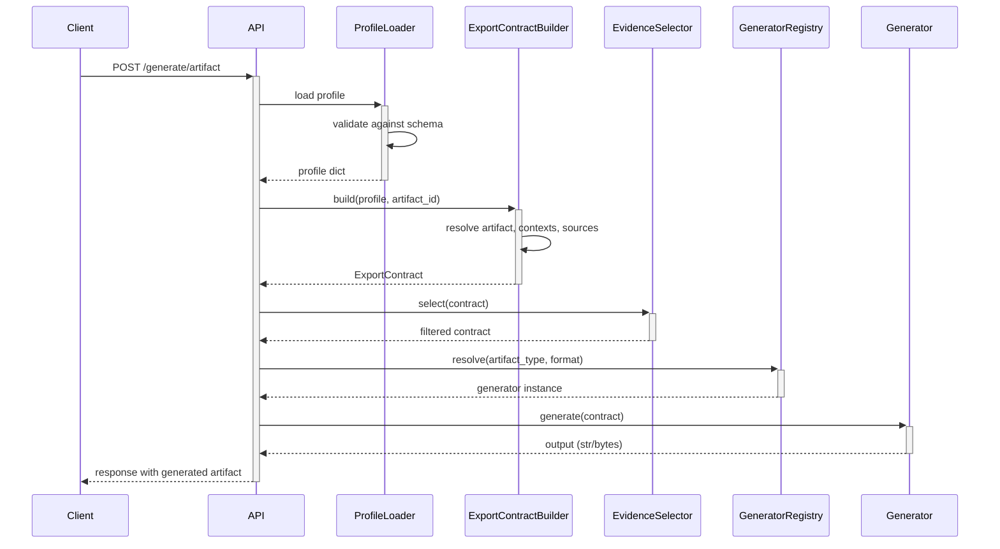
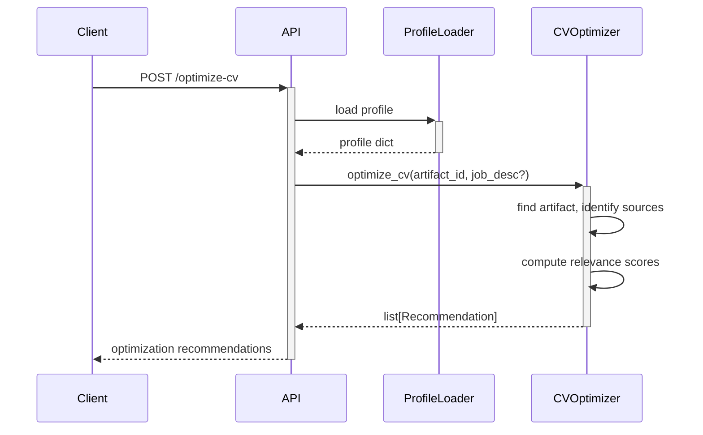

# 05 — Data Flow

## Primary Flow: Profile → Reasoning → Generation

## Acquisition Flow: Source Document → Profile

```mermaid
flowchart LR
    Source["Source DOCX"]
    Reader["DocumentReader<br/>read(path)"]
    Raw["Raw Text"]
    Extractor["TextExtractor<br/>extract(text)"]
    Clean["Cleaned Text"]
    LLM["LLMExtractor<br/>extract(text)"]
    Extracted["ExtractionResult"]
    Builder["CanonicalProfileBuilder<br/>normalize + build"]
    Built["Profile dict"]
    AcqValidator["EntityValidator<br/>validate(profile)"]
    YamlWriter["YamlWriter<br/>write(profile)"]
    ProfileFile["profiles/staging/*.yaml"]

    Source --> Reader
    Reader --> Raw
    Raw --> Extractor
    Extractor --> Clean
    Clean --> LLM
    LLM --> Extracted
    Extracted --> Builder
    Builder --> Built
    Built --> AcqValidator
    AcqValidator --> YamlWriter
    YamlWriter --> ProfileFile
```

## Reasoning Internal Data Flow

## API Request Flows

### Artifact Generation

### CV Optimization

## Reasoning Data Types (per-rule)

Each reasoning rule reads from the `KnowledgeGraph` via `RuleContext` and produces `ReasoningResult` instances with typed values:

| Rule | Inputs (graph queries) | Output Value Type |
|---|---|---|
| `TotalYearsExperienceRule` | `experiences()` | `float` (years) |
| `CurrentEmployerRule` | `experiences()`, `organizations()` | `str` (org name) |
| `CurrentRoleRule` | `experiences()` | `str` (title) |
| `LongestTenureRule` | `experiences()`, `organizations()` | `dict` |
| `CareerProgressionRule` | `experiences()`, `organizations()` | `dict` (events + summary) |
| `EmploymentGapRule` | `experiences()` | `list[dict]` (gaps) |
| `CareerStageRule` | `experiences()` | `str` (stage label) |
| `StrongestExperienceRule` | `experiences()`, `skills_used_by()` | `list[dict]` (ranked) |
| `LeadershipExperienceRule` | `experiences()`, `organizations()` | `dict` (leadership info) |
| `CloudExperienceRule` | `skills()` | `dict` (cloud providers) |
| `TechnologyBreadthRule` | `skills()`, `experiences()`, `skills_used_by()` | `dict` (tech stats) |
| `DomainExperienceRule` | `experiences()`, `organizations()`, `skills()` | `dict` (industry mapping) |
| `SeniorResponsibilityRule` | `experiences()`, `organizations()`, `skills()` | `dict` (responsibility areas) |
| `CareerHighlightsRule` | `experiences()`, `organizations()`, `skills()`, `skills_used_by()` | `dict` (highlights) |
