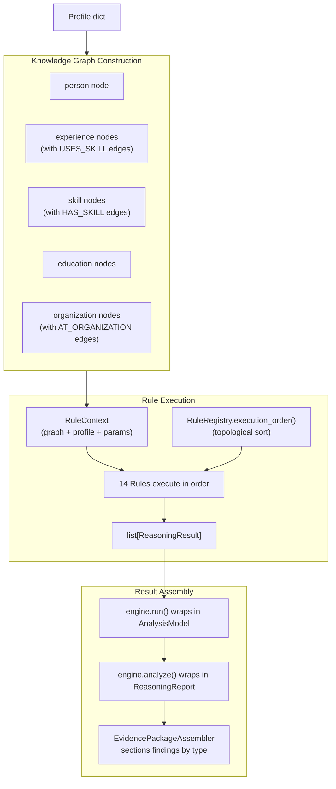
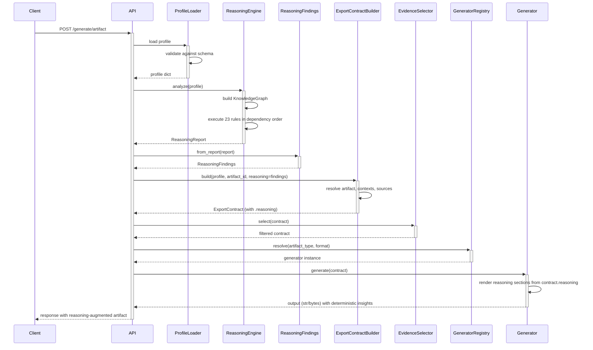
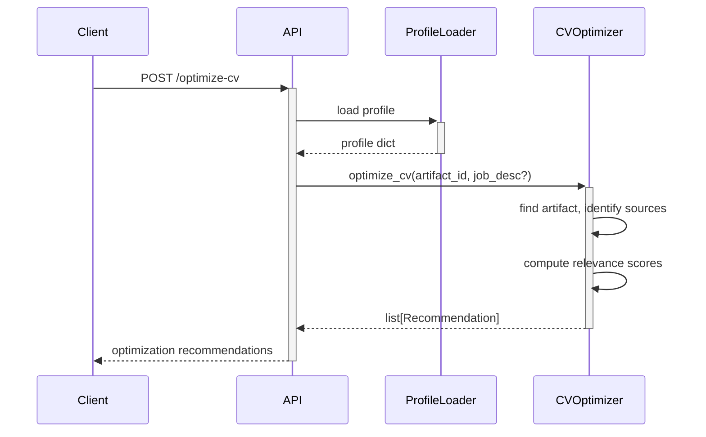

# 05 — Data Flow

## Primary Flow: Profile → Reasoning → Generation

```mermaid
flowchart LR
    subgraph Input["Input"]
        ProfileFile["Profile YAML/JSON"]
    end

    subgraph Load["Load"]
        ProfileLoader["ProfileLoader<br/>load(file)"]
        Validator["EntityValidator<br/>validate(profile)"]
    end

    subgraph ReasoningFlow["Reasoning"]
        KG["KnowledgeGraphBuilder<br/>build(profile)"]
        KG_Graph["KnowledgeGraph"]
        Engine["ReasoningEngine<br/>analyze(profile)"]
        Report["ReasoningReport"]
        Findings["ReasoningFindings<br/>from_report(report)"]
        Assembler["EvidencePackageAssembler<br/>assemble(analysis)"]
        Package["EvidencePackage"]
    end

    subgraph Contract["Contract"]
        ExportBuilder["ExportContractBuilder<br/>build(profile, artifact_id, reasoning=findings)"]
        ExportContract["ExportContract<br/>+reasoning: ReasoningFindings"]
        EvidenceSelector["EvidenceSelector<br/>select(contract)"]
    end

    subgraph GenerationFlow["Generation"]
        Registry["GeneratorRegistry<br/>resolve(type, format)"]
        Generator["ArtifactGenerator<br/>generate(contract)"]
    end

    subgraph Output["Output"]
        MD["Markdown CV (.md) + reasoning sections"]
        DOCX["DOCX CV (.docx)"]
        CL["Cover Letter (.md)"]
    end

    ProfileFile --> ProfileLoader
    ProfileLoader --> Validator
    Validator --> KG
    KG --> KG_Graph
    KG_Graph --> Engine
    Engine --> Report
    Report --> Findings
    Findings --> ExportBuilder
    Validator --> ExportBuilder
    ExportBuilder --> ExportContract
    ExportContract --> EvidenceSelector
    EvidenceSelector --> Registry
    Registry --> Generator
    Generator --> MD
    Generator --> DOCX
    Generator --> CL
```

## Acquisition Flow: Source Document → Profile

```mermaid
flowchart LR
    Source["Source DOCX"]
    Reader["DocumentReader<br/>read(path)"]
    Raw["Raw Text"]
    Extractor["TextExtractor<br/>extract(text)"]
    Clean["Cleaned Text"]
    LLM["LLMExtractor<br/>extract(text)"]
    Extracted["ExtractionResult"]
    Builder["CanonicalProfileBuilder<br/>normalize + build"]
    Built["Profile dict"]
    AcqValidator["EntityValidator<br/>validate(profile)"]
    YamlWriter["YamlWriter<br/>write(profile)"]
    ProfileFile["profiles/staging/*.yaml"]

    Source --> Reader
    Reader --> Raw
    Raw --> Extractor
    Extractor --> Clean
    Clean --> LLM
    LLM --> Extracted
    Extracted --> Builder
    Builder --> Built
    Built --> AcqValidator
    AcqValidator --> YamlWriter
    YamlWriter --> ProfileFile
```

## Reasoning Internal Data Flow

## API Request Flows

### Artifact Generation (Reasoning-Aware)

### CV Optimization

## Reasoning–Generation Integration (PA-004)

The pipeline entry point `generate_artifact()` in `careeros/pipelines.py` now runs reasoning exactly once per call:

1. **Profile loaded** via `ProfileLoader`
2. **Reasoning executed** via `ReasoningEngine.analyze(profile)` → `ReasoningReport`
3. **Findings extracted** via `ReasoningFindings.from_report(report)` — a lightweight DTO with only the fields generators need
4. **Contract built** via `ExportContractBuilder.build(..., reasoning=findings)` — attaches findings to `ExportContract.reasoning`
5. **Sources filtered** via `EvidenceSelector.select(contract)` — unchanged, operates on sources only
6. **Generator renders** — checks `contract.reasoning` and includes deterministic insights when present

### ReasoningFindings fields exposed to generators

| Field | Source Finding Type | Description |
|---|---|---|
| `strongest_skills` | `strongest_skills` | Ranked skill names |
| `core_competencies` | `core_competencies` | Core competency names |
| `strongest_experience` | `strongest_experience` | Top experience dict |
| `leadership_indicators` | `leadership_experience` | Leadership evidence dicts |
| `technology_breadth` | `technology_breadth` | Technology area names |
| `domain_expertise` | `domain_experience` | Domain names |
| `career_highlights` | `career_highlights` | Highlight dicts |
| `career_stage` | `career_stage_classification` | Stage label (e.g. "Senior") |

### Backward Compatibility

- If no `ReasoningFindings` is attached, `contract.reasoning` is `None` and generators render identically to previous behavior.
- The `to_dict()` method on `ExportContract` intentionally omits the `reasoning` field to avoid serialization changes.
- All existing tests pass without modification.

## Reasoning Data Types (per-rule)

Each reasoning rule reads from the `KnowledgeGraph` via `RuleContext` and produces `ReasoningResult` instances with typed values:

| Rule | Inputs (graph queries) | Output Value Type |
|---|---|---|
| `TotalYearsExperienceRule` | `experiences()` | `float` (years) |
| `CurrentEmployerRule` | `experiences()`, `organizations()` | `str` (org name) |
| `CurrentRoleRule` | `experiences()` | `str` (title) |
| `LongestTenureRule` | `experiences()`, `organizations()` | `dict` |
| `CareerProgressionRule` | `experiences()`, `organizations()` | `dict` (events + summary) |
| `EmploymentGapRule` | `experiences()` | `list[dict]` (gaps) |
| `CareerStageRule` | `experiences()` | `str` (stage label) |
| `StrongestExperienceRule` | `experiences()`, `skills_used_by()` | `list[dict]` (ranked) |
| `LeadershipExperienceRule` | `experiences()`, `organizations()` | `dict` (leadership info) |
| `CloudExperienceRule` | `skills()` | `dict` (cloud providers) |
| `TechnologyBreadthRule` | `skills()`, `experiences()`, `skills_used_by()` | `dict` (tech stats) |
| `DomainExperienceRule` | `experiences()`, `organizations()`, `skills()` | `dict` (industry mapping) |
| `SeniorResponsibilityRule` | `experiences()`, `organizations()`, `skills()` | `dict` (responsibility areas) |
| `CareerHighlightsRule` | `experiences()`, `organizations()`, `skills()`, `skills_used_by()` | `dict` (highlights) |
