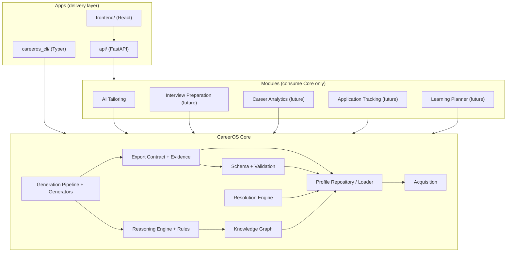

# 09 — Core Platform Boundaries and Module Strategy

## Purpose

Platform Beta M1.11 architectural review. This document defines what belongs to the **Core** (shared, module-independent foundation) versus what belongs to the **AI Tailoring module** (a consumer of Core), so future Platform Beta modules (Interview Preparation, Career Analytics, Learning Planner, Application Tracking, Skill Gap Analysis) can reuse Core without coupling to AI Tailoring.

It supersedes the module analysis in [03-module-dependencies.md](03-module-dependencies.md) for boundary purposes. The Mermaid map there is partially outdated (the frontend now has source under `frontend/`; `httpx` is a declared dependency in `pyproject.toml`).

## Definitions

- **Core** — deterministic, module-neutral library code under `careeros/` that any module or app may depend on. It owns the canonical profile, schema, validation, knowledge, reasoning, resolution, export, and generation machinery. Core must not depend on any module's concepts.
- **Module** — a Platform Beta capability built on Core (AI Tailoring today; Interview Preparation, Career Analytics, Learning Planner, Application Tracking, Skill Gap Analysis later). Modules may depend on Core but never on each other.
- **App** — thin delivery layers (`api/`, `careeros_cli/`, `frontend/`) that wire Core and modules to transports.

## Component Inventory

### Core (shared, module-independent)

| Component | Paths | Notes |
|---|---|---|
| Canonical profile schema | `schemas/*.schema.json` | Single source of truth for profile data |
| Schema loading | `careeros/schema_loader.py` | Filesystem-backed schema registry |
| Validation | `careeros/validator.py`, `careeros/models.py` | `EntityValidator`, `EntityRecord`, `ValidationResult` |
| Exceptions | `careeros/exceptions.py` | `CareerOSException` hierarchy |
| Profile loading / repository | `careeros/profile_loader.py`, `careeros/repository.py` | `ProfileLoader`, `FileSystemRepository` |
| Profile lifecycle | `careeros/profile_repository.py` | `ProfileRepository`, `ProfileState` (staging/canonical/archived) |
| Acquisition | `careeros/acquisition/` | `AcquisitionPipeline`, readers, builders, `LLMExtractor` (abstract + providers), `PersonData`, `YamlWriter` |
| Knowledge graph | `careeros/knowledge/` | `KnowledgeGraph`, `GraphNode`, `GraphEdge`, builder |
| Reasoning engine | `careeros/reasoning/` | `ReasoningEngine`, `RuleRegistry`, `Rule`, `Findings`, assembler, `rules/` (31 rules), `utils/` |
| **AI provider foundation** | `careeros/ai/` | NEW (M1.13): capability interface `AIProvider.generate`, `AIError`/`AIResponseError`, `create_ai_provider()` factory, `OpenAIProvider`/`OllamaProvider`/`MockAIProvider`. All vendor/HTTP code isolated here. See ADR-006. |
| **Resolution Engine** | `careeros/resolution.py` | NEW (M1.11): deterministic guided edits to the canonical profile + artifact lifecycle (stale marking). Transport-free, typed exceptions. See ADR-004. |
| Export contract | `careeros/export_contract.py` | `ExportContract`, `ExportContractBuilder`, `ExportSource` |
| Evidence selection | `careeros/evidence_selector.py` | Deterministic filtering of export sources |
| Artifact templates | `careeros/artifact_templates.py` | `TemplateRegistry`, `StandardCVTemplate` |
| Generation pipeline | `careeros/pipelines.py` | `generate_artifact`, `generate_markdown_cv` |
| Generators | `careeros/generators/` | Registry, `MarkdownCVGenerator`, `DocxCVGenerator`, `MarkdownPreparationGuideGenerator`, `DocxPreparationGuideGenerator` |
| **Measurability** | `careeros/measurability.py` | NEW (M1.17): `is_measurable(text: str) -> bool` — deterministic heuristic for measurable-outcome detection. Extracted from private reasoning rules to a public Core API. Available to all modules. |
| **Shared DOCX rendering** | `careeros/generators/docx_utils.py` | NEW (M1.16): shared `add_markdown_line` / `add_inline_text` extracted from duplicated code in `docx_cv.py` / `docx_letter.py` |

### AI Tailoring module (current)

| Component | Paths | Notes |
|---|---|---|
| Job-description optimizer | `careeros/optimizer.py` | `CVOptimizer`, requirement extraction (`_extract_requirements`, `extract_requirements`), `CONCEPT_TAXONOMY`, `RequirementConcept`, `Recommendation`, `OptimizationResult` / `Summary` / `Status` |
| Recommendation applier | `careeros/recommendation_applier.py` | Applies ADD recommendations to artifact models |
| CV docx renderer | `careeros/docx_renderer.py` | `CVDocumentRenderer` |
| Cover-letter generators | `careeros/generators/markdown_cover_letter.py`, `docx_letter.py` | Tailored interest letters |
| Tailored pipeline | `careeros/pipelines.py` → `generate_tailored_artifact` | Resides in core pipelines today (debt, see below) |
| Tailoring UI | `frontend/src/pages/TailoringPage.tsx`, `frontend/src/services/TailoringService.ts` | App layer |
| Tailoring API surface | `api/main.py` → `/tailor`, `/optimize`, `/resolve`, `/regenerate`, `/technology-keywords` | App layer |

### Interview Intelligence module (current)

| Component | Paths | Notes |
|---|---|---|
| Domain models | `careeros/interview/domain.py` | (M1.14): `InterviewQuestion`, `QuestionType` (6 categories), `Competency`, `EvidenceCitation`, `SuggestedAnswer`, `InterviewPlan`, `PreparationGuide`. References canonical elements only. |
| Deterministic engine | `careeros/interview/engine.py` | (M1.14): `InterviewEngine.generate_plan(profile, *, target_role, target_context_id)` → `InterviewPlan`. (M1.16): `build_preparation_plan()` — derives target role from resolved target contexts and delegates to `InterviewEngine`. |
| Templates | `careeros/interview/templates.py` | (M1.14): parameterized `QuestionTemplate`s; registered set fires only when evidence exists. |
| Question instantiation | `careeros/interview/question_builder.py` | (M1.14): template rendering + structured STAR+ answer outlines. |
| Competency mapping | `careeros/interview/competency.py` | (M1.14): `CompetencyMapper` — view over skills + `CONCEPT_TAXONOMY`, never a parallel store. |
| Exceptions | `careeros/interview/exceptions.py` | (M1.14): `InterviewError` hierarchy extends `CareerOSException`. |
| **Preparation guide generator** | `careeros/generators/markdown_preparation_guide.py` | NEW (M1.16): `MarkdownPreparationGuideGenerator` — deterministic Markdown renderer of the Interview Plan (sections, questions, STAR outlines, checklist, evidence notes). Reuses `MarkdownCVGenerator._render_summary` / `_person_name`. |
| **DOCX guide generator** | `careeros/generators/docx_preparation_guide.py` | NEW (M1.16): `DocxPreparationGuideGenerator` — delegates to the markdown generator, renders via shared `docx_utils.py`. |
| **Shared DOCX helpers** | `careeros/generators/docx_utils.py` | NEW (M1.16): extracted from duplicated `docx_cv.py` / `docx_letter.py` `_add_markdown_line` / `_add_inline_text`; single source of truth for Markdown→DOCX conversion. |
| **Plan builder (artifact pipeline)** | `careeros/interview/engine.py` → `build_preparation_plan` | NEW (M1.16): called by `careeros/pipelines.generate_artifact` when artifact type is `INTERVIEW_PREPARATION_GUIDE`; attaches the plan to `ExportContract.interview_plan`. |

**Shared reasoning rules.** `reasoning/rules/` mixes profile-quality rules (Core-reusable: `ProjectWithoutSkillsRule`, `ExperienceNoTechnologiesRule`, `SkillWithoutExperienceRule`, `NoMeasurableAchievementRule`, tenure/skill rules) with tailoring-oriented recommendation rules. The measurability heuristic previously embedded in `_is_measurable` has been promoted to Core (`careeros/measurability.py`); the rules file retains a thin wrapper that delegates to the public `careeros.measurability.is_measurable` while still handling dict-specific fields (`metrics` array). Resolution Engine no longer imports from reasoning internals — it consumes the public Core API. The engine is generic; the rules are the only tailoring-ish part. Rules that suggest CV edits (e.g. "add skills to project") remain useful to other modules (Skill Gap Analysis, Interview Preparation), so they are treated as Core with a tailoring consumer, not as module code.

## Dependency Review

### Findings

| # | Dependency | Direction | Verdict |
|---|---|---|---|
| 1 | `api/main.py` → `careeros.reasoning.rules.recommendation_rules` (`TECHNOLOGY_KEYWORDS`, `_is_measurable`) | app → rules internals | **Fixed** (M1.17: `_is_measurable` promoted to Core public API `careeros.measurability.is_measurable`; resolution.py now imports from Core; app imports only `TECHNOLOGY_KEYWORDS`) |
| 2 | `careeros/generators/markdown_cover_letter.py` → `CVOptimizer._extract_requirements` | core generator → tailoring optimizer (private) | **Fixed** (public `CVOptimizer.extract_requirements` wrapper; generator uses public API) |
| 3 | `careeros/pipelines.py` → `CVOptimizer`, `OptimizationResult`, `RecommendationApplier` | core pipeline → tailoring optimizer | Accepted for M1.11 (see debt) |
| 4 | `careeros/generators/markdown_cv.py` + `careeros/acquisition/llm_extractor.py` → vendor HTTP/`httpx` | core consumers → AI providers | **Fixed (M1.13)** — moved behind `careeros/ai/` capability interface (ADR-006) |
| 5 | `api/main.py` inline resolution logic | app → (previously) inline duplication | **Fixed** (extracted to `careeros/resolution.py`, consumed via public facade) |
| 6 | `careeros/pipelines.py` → `careeros/interview/engine.py` (build_preparation_plan) | core pipeline → interview module | Accepted for M1.16 (same pattern as finding #3 — interview plan built inside the generic pipeline, not a separate entrypoint) |

### Inversiones fixed this milestone

1. **Resolution Engine extraction** — the `/resolve` behavior moved from `api/main.py` into `careeros/resolution.py` and is exported from the `careeros` facade (`apply_resolution`, `RESOLVABLE_RULES`, typed exceptions). The API now only maps transport errors. See ADR-004.
2. **Private rule access** — `_is_measurable` is no longer imported by the app; it is encapsulated in the Resolution Engine.
3. **Private optimizer access** — `markdown_cover_letter.py` now calls `CVOptimizer.extract_requirements` (public) instead of `_extract_requirements` (private).

### Addressed in M1.13 (ADR-006)

4. **AI provider abstraction** — `careeros/ai/` now owns all vendor/HTTP code. `markdown_cv.py` and `llm_extractor.py` depend only on `AIProvider` + `create_ai_provider()`; selection stays configuration-driven (`LLM_PROVIDER`); a deterministic `MockAIProvider` enables offline tests; `api/runtime_config.py` derives its provider list from Core.

### Delivered in M1.14 (Interview Intelligence foundation)

5. **Interview Intelligence module** — `careeros/interview/` is the first Platform Beta module designed under ADR-004/005 and physically composed in the Core package (same pattern as AI Tailoring). It proves the "true Core consumer" claim: it reuses `KnowledgeGraphBuilder`/`KnowledgeGraph` for skill→experience navigation, `CONCEPT_TAXONOMY` + `CVOptimizer.extract_requirements` for competency/role concepts, and the ADR-002 reference contract for all citations — with zero duplicated reasoning and zero parallel knowledge stores. No LLM, no REST, no frontend in M1.14.

### Delivered in M1.16 (Interview Preparation Guide generation)

6. **Interview Preparation Guide as a first-class artifact.** `InterviewPlan` now flows through `ExportContract.interview_plan` into `MarkdownPreparationGuideGenerator` / `DocxPreparationGuideGenerator` via the generic `generate_artifact` pipeline — the same pipeline that produces CVs, cover letters, and interest letters. No parallel document infrastructure.

7. **Shared DOCX rendering.** `generators/docx_utils.py` (`add_markdown_line` / `add_inline_text`) extracted from duplicated code in `docx_cv.py` and `docx_letter.py`. The new `DocxPreparationGuideGenerator` uses it directly. Risk #2 (implicit cross-generator coupling) is now resolved.

8. **Extensibility.** The plan type introduced in M1.16 consists of:
    - `ExportContract.interview_plan` typed via `TYPE_CHECKING` (no Core→module runtime dependency)
    - `build_preparation_plan()` in `careeros/interview/engine.py` — derives target role from the artifact's resolved target contexts
    - Generators registered in `default_generator_registry` under `("INTERVIEW_PREPARATION_GUIDE", "markdown")` / `("INTERVIEW_PREPARATION_GUIDE", "docx")`
    - The artifact lifecycle (sourceRefs + stale marking via Resolution Engine) works identically to CVs and cover letters

### Delivered in M1.17 (Public Measurability API)

9. **Measurability promoted to Core.** The private `_is_measurable` helper in `careeros.reasoning.rules.recommendation_rules` is now a public, module-neutral Core API at `careeros/measurability.py`.
    - Public function: `careeros.measurability.is_measurable(text: str) -> bool`
    - The reasoning rules file retains a thin dict-wrapper `_is_measurable(dict)` that delegates to the Core function for text analysis while still handling the `metrics` array field — no behavior change for rules consumers.
    - `careeros/resolution.py` now imports `is_measurable` from Core (`from .measurability import is_measurable`) instead of the private module. The old private import path in dependency finding #1 is fully resolved.
    - Exported from `careeros/__init__.py` (`from careeros import is_measurable`)
    - 28 new tests covering measurable/non-measurable statements, edge cases, determinism, facad export, resolution regression, and backward-compatibility of the dict wrapper.

## Proposed Target Architecture

Core is a stable, dependency-ordered stack. Modules sit on top and never on each other. Apps are the only place where transports and module composition live.

**Layer rule.** `Schema → Profile → Knowledge → Reasoning → Resolution/Export → Generation` and `Acquisition → Profile`. Modules depend on Core only. Apps depend on Core + modules. No Core component may import a module component.

## Boundary Rules for Future Modules

1. A module may depend on Core, never on another module.
2. A module must not modify the canonical profile except through deterministic Core services (Validation, Resolution Engine, Profile Repository). No module writes profile YAML directly.
3. LLM access belongs in modules or behind Core provider abstractions — never embedded in a Core generator.
4. Artifact lifecycle (`status`, stale marking, regeneration) is Core policy; modules merely trigger regeneration explicitly.
5. Module concepts (job descriptions, optimization metrics, interview question banks, skill targets) must not leak into Core DTOs or schemas.

## Recommended Next Steps (not done in M1.11)

- **Extract `generate_tailored_artifact`** from `careeros/pipelines.py` into a tailoring module (e.g. `careeros/tailoring/`) behind a re-export shim so `from careeros import generate_tailored_artifact` keeps working.
- **Move cover-letter generators** out of `careeros/generators/` into the tailoring module.
- **Harden the reasoning layer** against `KnowledgeGraph` (abstract interface; ADR-005/0005 debt noted in `07-technical-debt.md`).
- **Resolve the `careeros/` subpackage packaging risk** — `pyproject.toml` lists only `packages = ["careeros"]`; confirm `reasoning/`, `knowledge/`, `acquisition/`, `generators/`, `ai/` are included in built distributions (`pip install .` smoke test).
