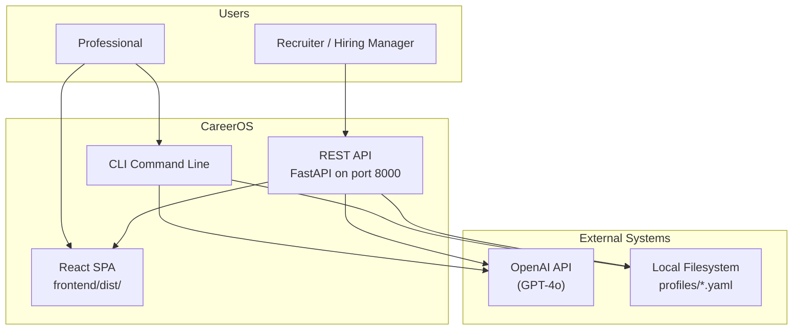
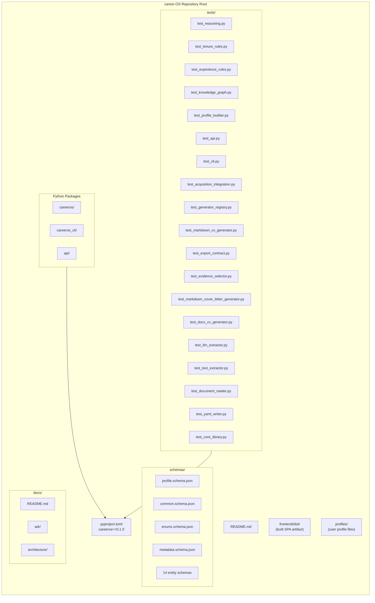
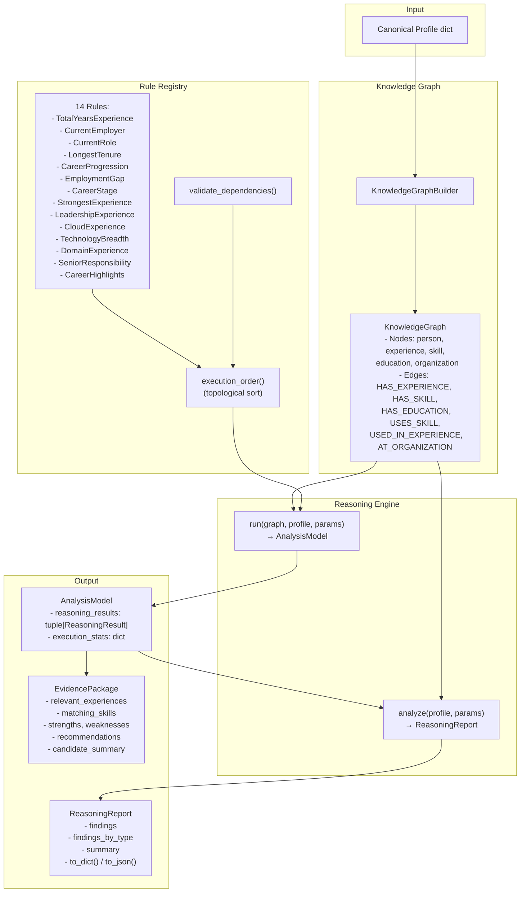
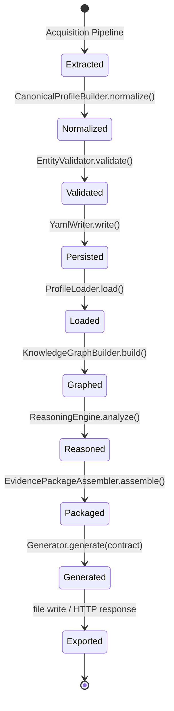
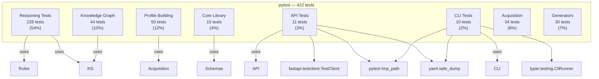

# Architecture Diagram

## System Context

```mermaid
graph TB
    subgraph Users["Users"]
        Human["Professional"]
        Recruiter["Recruiter / Hiring Manager"]
    end

    subgraph CareerOS["CareerOS"]
        CLI["CLI Command Line"]
        API["REST API<br/>FastAPI on port 8000"]
        Frontend["React SPA<br/>frontend/dist/"]
    end

    subgraph External["External Systems"]
        OpenAI["OpenAI API<br/>(GPT-4o)"]
        FsSystem["Local Filesystem<br/>profiles/*.yaml"]
    end

    Human --> CLI
    Human --> Frontend
    Recruiter --> API
    CLI --> FsSystem
    API --> FsSystem
    API --> Frontend
    CLI --> OpenAI
    API --> OpenAI
```

## Container Diagram

```mermaid
graph TB
    subgraph Applications["Applications"]
        CLI_APP["careeros-cli<br/>Typer App<br/>13 commands"]
        API_APP["careeros-api<br/>FastAPI App<br/>14 endpoints"]
    end

    subgraph CoreLib["careeros Core Library"]
        direction TB

        subgraph Core["Core Services"]
            SchemaLoader["SchemaLoader"]
            Validator["EntityValidator"]
            ProfileLoader["ProfileLoader"]
            Repository["FileSystemRepository"]
        end

        subgraph Knowledge["Knowledge Layer"]
            KGBuilder["KnowledgeGraphBuilder"]
            KGGraph["KnowledgeGraph<br/>5 node types<br/>7 edge types"]
        end

        subgraph Reasoning["Reasoning Layer"]
            Registry["RuleRegistry<br/>14 rules"]
            Engine["ReasoningEngine"]
            Rules["Tenure Rules (7)<br/>Experience Rules (7)"]
            Assembler["EvidencePackageAssembler"]
        end

        subgraph Generation["Generation Layer"]
            ExportBuilder["ExportContractBuilder"]
            EvidenceSel["EvidenceSelector"]
            GenRegistry["GeneratorRegistry"]
            MDCV["MarkdownCVGenerator"]
            DocxCV["DocxCVGenerator"]
            MDCL["MarkdownCoverLetterGenerator"]
        end

        subgraph Acquisition["Acquisition Layer"]
            DocReader["DocumentReader"]
            TextExt["TextExtractor"]
            LLMExt["OpenAILLMExtractor"]
            ProfileBuilder["CanonicalProfileBuilder"]
            YamlW["YamlWriter"]
        end

        subgraph Optimization["Optimization"]
            CVOpt["CVOptimizer"]
            DocxRender["CVDocumentRenderer"]
        end

        Pipelines["Pipelines<br/>generate_artifact()"]
    end

    subgraph Schemas["JSON Schema Definitions"]
        Common["common.schema.json"]
        Enums["enums.schema.json"]
        Meta["metadata.schema.json"]
        ProfileSchema["profile.schema.json"]
        EntitySchemas["14 entity schemas<br/>(skill, education, ...)"]
    end

    subgraph Storage["Data Storage"]
        ProfileFiles["profiles/*.yaml"]
        EntityFiles["entities/*.json"]
    end

    %% Application → Core
    CLI_APP --> CoreLib
    API_APP --> CoreLib

    %% Core internal flows
    SchemaLoader --> Schemas
    Validator --> SchemaLoader
    Validator --> ProfileSchema
    ProfileLoader --> SchemaLoader
    ProfileLoader --> Validator
    ProfileLoader --> ProfileFiles
    Repository --> Validator
    Repository --> EntityFiles

    %% Knowledge
    KGBuilder --> KGGraph

    %% Reasoning
    Engine --> Registry
    Engine --> KGGraph
    Registry --> Rules
    Engine --> Assembler

    %% Generation
    Pipelines --> ProfileLoader
    Pipelines --> ExportBuilder
    Pipelines --> EvidenceSel
    Pipelines --> GenRegistry
    ExportBuilder --> Validator
    ExportBuilder --> ProfileSchema
    EvidenceSel --> ExportBuilder
    GenRegistry --> MDCV
    GenRegistry --> DocxCV
    GenRegistry --> MDCL

    %% Acquisition
    DocReader --> TextExt
    TextExt --> LLMExt
    LLMExt --> ProfileBuilder
    ProfileBuilder --> YamlW
    YamlW --> ProfileFiles

    %% Optimization
    CVOpt --> ProfileLoader
    CVOpt --> ExportBuilder
    DocxRender --> CVOpt

    %% External
    LLMExt --> OpenAI
```

## Module Structure

```mermaid
graph TB
    subgraph Repo["career-OS Repository Root"]
        direction TB

        PyProject["pyproject.toml<br/>careeros==0.1.0"]
        README["README.md"]

        subgraph Python["Python Packages"]
            CORE["careeros/"]
            CLI_PKG["careeros_cli/"]
            API_PKG["api/"]
        end

        subgraph Tests["tests/"]
            T_REASON["test_reasoning.py"]
            T_TENURE["test_tenure_rules.py"]
            T_EXP["test_experience_rules.py"]
            T_KG["test_knowledge_graph.py"]
            T_PROFILE["test_profile_builder.py"]
            T_API["test_api.py"]
            T_CLI["test_cli.py"]
            T_ACQ["test_acquisition_integration.py"]
            T_GEN["test_generator_registry.py"]
            T_MDCV["test_markdown_cv_generator.py"]
            T_EXPORT["test_export_contract.py"]
            T_EVIDENCE["test_evidence_selector.py"]
            T_MDCL["test_markdown_cover_letter_generator.py"]
            T_DOCX["test_docx_cv_generator.py"]
            T_LLM["test_llm_extractor.py"]
            T_TEXT["test_text_extractor.py"]
            T_READER["test_document_reader.py"]
            T_YAML["test_yaml_writer.py"]
            T_CORE["test_core_library.py"]
        end

        subgraph SchemasDir["schemas/"]
            PROFILE_S["profile.schema.json"]
            COMMON_S["common.schema.json"]
            ENUMS_S["enums.schema.json"]
            META_S["metadata.schema.json"]
            OTHER_S["14 entity schemas"]
        end

        subgraph Docs["docs/"]
            README_D["README.md"]
            ADR["adr/"]
            ARCH["architecture/"]
        end

        FRONT["frontend/dist/<br/>(built SPA artifact)"]
        PROFILES["profiles/<br/>(user profile files)"]

        Python --> PyProject
        Tests --> PyProject
    end
```

## Reasoning Architecture (Detailed)

```mermaid
graph TB
    subgraph Input["Input"]
        Profile["Canonical Profile dict"]
    end

    subgraph KnowledgeGraph["Knowledge Graph"]
        Builder["KnowledgeGraphBuilder"]
        Graph["KnowledgeGraph<br/>- Nodes: person, experience, skill,<br/>  education, organization<br/>- Edges: HAS_EXPERIENCE, HAS_SKILL,<br/>  HAS_EDUCATION, USES_SKILL,<br/>  USED_IN_EXPERIENCE, AT_ORGANIZATION"]
    end

    subgraph Registry["Rule Registry"]
        Order["execution_order()<br/>(topological sort)"]
        Validate["validate_dependencies()"]
        Rules["14 Rules:<br/>- TotalYearsExperience<br/>- CurrentEmployer<br/>- CurrentRole<br/>- LongestTenure<br/>- CareerProgression<br/>- EmploymentGap<br/>- CareerStage<br/>- StrongestExperience<br/>- LeadershipExperience<br/>- CloudExperience<br/>- TechnologyBreadth<br/>- DomainExperience<br/>- SeniorResponsibility<br/>- CareerHighlights"]
    end

    subgraph Engine["Reasoning Engine"]
        Run["run(graph, profile, params)<br/>→ AnalysisModel"]
        Analyze["analyze(profile, params)<br/>→ ReasoningReport"]
    end

    subgraph Output["Output"]
        Analysis["AnalysisModel<br/>- reasoning_results: tuple[ReasoningResult]<br/>- execution_stats: dict"]
        Report["ReasoningReport<br/>- findings<br/>- findings_by_type<br/>- summary<br/>- to_dict() / to_json()"]
        Package["EvidencePackage<br/>- relevant_experiences<br/>- matching_skills<br/>- strengths, weaknesses<br/>- recommendations<br/>- candidate_summary"]
    end

    Profile --> Builder
    Builder --> Graph
    Graph --> Run
    Run --> Analysis
    Analysis --> Analyze
    Analysis --> Package
    Analyze --> Report
    Rules --> Order
    Order --> Run
    Validate --> Order
    Graph --> Analyze
```

## Entity Lifecycle

```mermaid
stateDiagram-v2
    [*] --> Extracted: Acquisition Pipeline
    Extracted --> Normalized: CanonicalProfileBuilder.normalize()
    Normalized --> Validated: EntityValidator.validate()
    Validated --> Persisted: YamlWriter.write()
    Persisted --> Loaded: ProfileLoader.load()
    Loaded --> Graphed: KnowledgeGraphBuilder.build()
    Graphed --> Reasoned: ReasoningEngine.analyze()
    Reasoned --> Packaged: EvidencePackageAssembler.assemble()
    Packaged --> Generated: Generator.generate(contract)
    Generated --> Exported: file write / HTTP response
    Exported --> [*]
```

## Test Architecture

```mermaid
graph TB
    subgraph TestSuite["pytest — 422 tests"]
        REASON_TESTS["Reasoning Tests<br/>228 tests<br/>(54%)"]
        KG_TESTS["Knowledge Graph<br/>44 tests<br/>(10%)"]
        PROFILE_TESTS["Profile Building<br/>50 tests<br/>(12%)"]
        CORE_TESTS["Core Library<br/>15 tests<br/>(4%)"]
        API_TESTS["API Tests<br/>11 tests<br/>(3%)"]
        CLI_TESTS["CLI Tests<br/>10 tests<br/>(2%)"]
        ACQ_TESTS["Acquisition<br/>34 tests<br/>(8%)"]
        GEN_TESTS["Generators<br/>30 tests<br/>(7%)"]
    end

    REASON_TESTS --> |uses| Rules
    REASON_TESTS --> |uses| KG
    KG_TESTS --> |uses| KG
    PROFILE_TESTS --> |uses| Acquisition
    CORE_TESTS --> |uses| Schemas
    API_TESTS --> |uses| API
    CLI_TESTS --> |uses| CLI

    TestClient["fastapi.testclient.TestClient"]
    CliRunner["typer.testing.CliRunner"]
    TmpPath["pytest tmp_path"]
    YamlDump["yaml.safe_dump"]

    API_TESTS --> TestClient
    CLI_TESTS --> CliRunner
    API_TESTS --> TmpPath
    CLI_TESTS --> TmpPath
    API_TESTS --> YamlDump
    CLI_TESTS --> YamlDump
```
