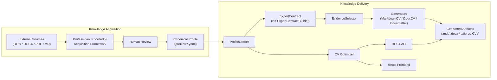
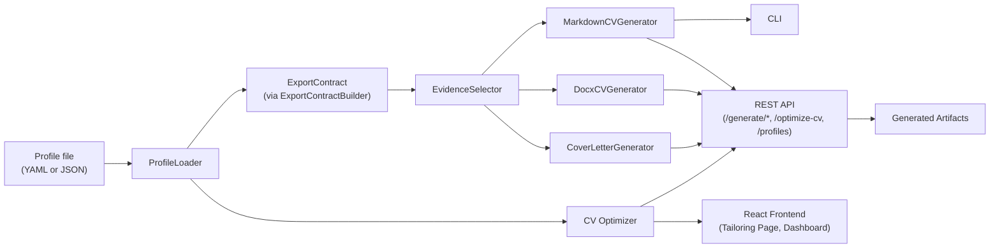

# CareerOS System Flow

CareerOS has two architectural directions: **acquisition** (knowledge in) and **delivery** (knowledge out).

## End-to-End Flow



## Acquisition Flow

The acquisition pipeline ingests professional knowledge from external sources and produces validated canonical profile YAML.

```mermaid
flowchart LR
    Source["Source Document<br/>(DOC / DOCX / PDF / MD / ...)"]
    Parser["Parser"]
    ParserOut["ParsedDocument<br/>(text + structure + metadata)"]
    Extractor["Extractor<br/>(LLM + heuristics)"]
    Extraction["ExtractionResult<br/>(entities + confidence + source refs)"]
    Normalizer["Normalizer"]
    Normalized["NormalizedProfile<br/>(schema-ready)"]
    Validator["Validator<br/>(schema + business rules)"]
    Report["ValidationReport"]
    Review["Human Review"]
    Approved["Approved Profile"]
    ProfileFile["Canonical Profile YAML<br/>(profiles/*.yaml)"]

    Source --> Parser
    Parser --> ParserOut
    ParserOut --> Extractor
    Extractor --> Extraction
    Extraction --> Normalizer
    Normalizer --> Normalized
    Normalized --> Validator
    Validator --> Report
    Report --> Review
    Review --> Approved
    Approved --> ProfileFile
```



## Delivery Flow

The delivery pipeline reads canonical profile data and generates audience-specific artifacts.



## Current CLI Flow

```text
Profile -> ProfileLoader -> ExportContract -> EvidenceSelector -> MarkdownCVGenerator -> CLI -> output file
```

## Current API Flow

```text
Profile -> ProfileLoader -> ExportContract -> EvidenceSelector -> MarkdownCVGenerator -> API -> Markdown response
```
