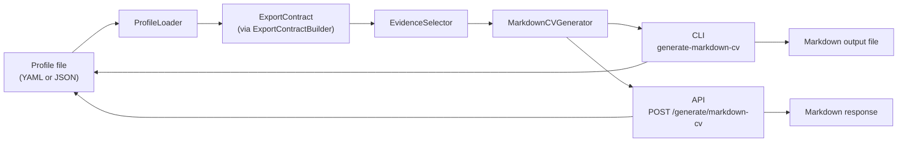

# CareerOS System Flow

This diagram reflects the current implemented Markdown CV generation flow.



Current CLI flow:

```text
Profile -> ProfileLoader -> ExportContract -> EvidenceSelector -> MarkdownCVGenerator -> CLI -> output file
```

Current API flow:

```text
Profile -> ProfileLoader -> ExportContract -> EvidenceSelector -> MarkdownCVGenerator -> API -> Markdown response
```
