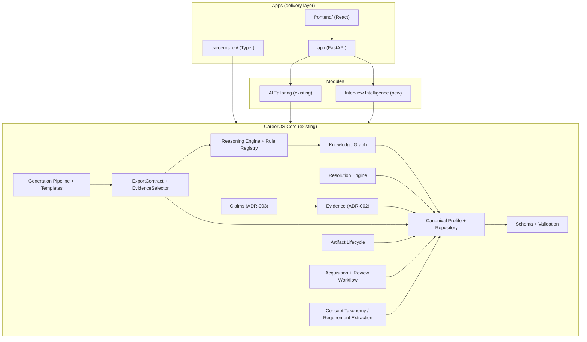
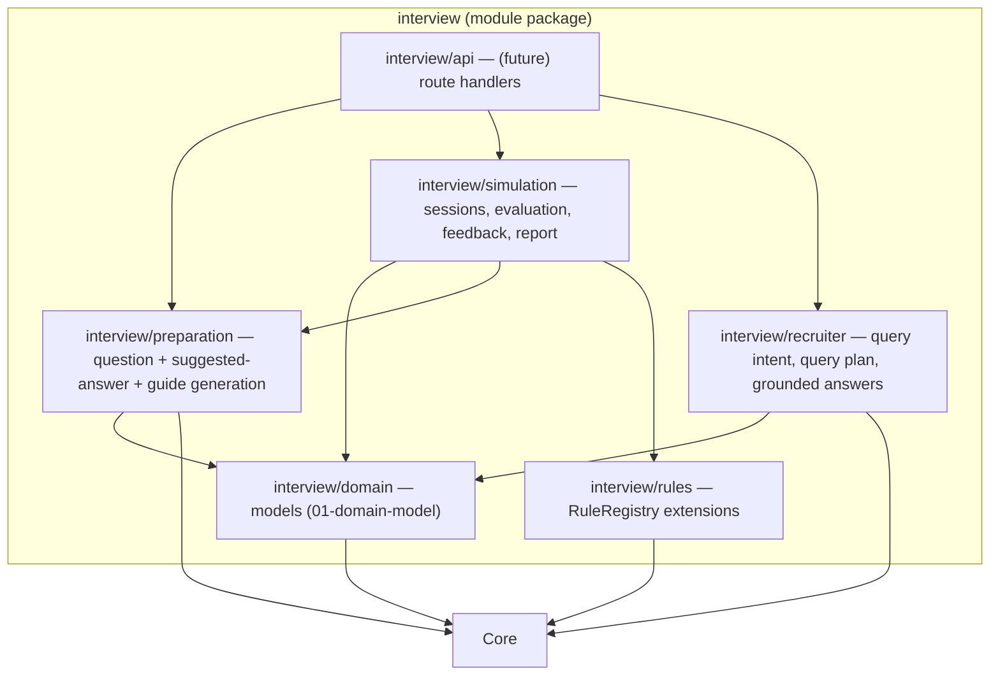

# Interview Intelligence — 04. Architecture

## Module Placement

Interview Intelligence is a **Core consumer** module, sibling to AI Tailoring, delivered through the existing app layer.



**Constraint:** `Core` and `AI Tailoring` have no edge into `Interview Intelligence`. Interview Intelligence may reuse AI Tailoring's *public* concept-matching API (`CVOptimizer.extract_requirements`, `CONCEPT_TAXONOMY`) — via Core facade where possible — but it must never depend on tailoring-specific internals or the tailoring UI/API.

## Interview Intelligence Internal Structure



- **domain** — pure dataclasses/enums, no IO.
- **preparation** — deterministic question instantiation and answer-outline building.
- **simulation** — session state machine + `Evaluation` signals + `Feedback`.
- **recruiter** — intent classification + `queryPlan` over `KnowledgeGraph`/evidence.
- **rules** — new `Rule` implementations registered into the Core `RuleRegistry` (the only way the module contributes analysis).
- **api** — thin transport adapters (future), mapping module errors like the existing API does.

## Dependency Rules

1. Core never imports `interview` (or any module).
2. `interview` imports Core only (public facade and documented public APIs).
3. Apps compose Core + modules; apps are the only place transports live.
4. Module-owned persistence (sessions, plans, reports) is module-local state and never writes the canonical profile.
5. Document generation for prep guides / reports reuses the Core artifact pipeline; the module supplies a template, not a renderer.

## Error / Data Flow Shape

```
Recruiter question ──► intent + queryPlan (deterministic)
                          └─► KnowledgeGraph + evidence lookup ──► cited facts ──► RecruiterAnswer

Profile + target role ──► question targeting (deterministic) ──► InterviewPlan
                              └─► SuggestedAnswer (claims+evidence+achievements)

Answer text ──► Evaluation signals (pure functions) ──► Feedback ──► InterviewReport (artifact)
```
