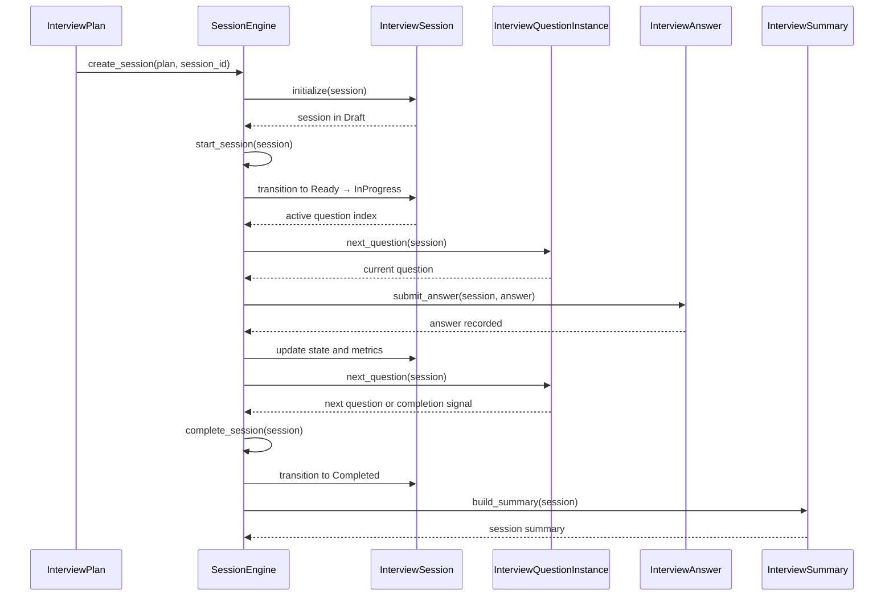

# Interview Simulation Session Engine Design

This document defines the architecture of the Interview Simulation session engine. It freezes the engine responsibilities, public contract, lifecycle, and extension boundaries for M1.17.3.

## Responsibilities

The session engine owns orchestration only. It is responsible for:

- creating and initializing sessions from an `InterviewPlan`
- starting a session and advancing session state
- selecting the next question in the session sequence
- recording submitted answers against the active question
- pausing and resuming sessions
- completing sessions and marking them ready for summary
- building `InterviewSummary` payloads from completed session state
- enforcing session lifecycle rules and state transitions
- maintaining separation between runtime session state and canonical knowledge

The session engine is explicitly not responsible for:

- evaluating answers
- generating AI feedback
- persistence or storage
- REST APIs or transport concerns
- frontend rendering or UI interaction
- modifying the canonical profile

## Non-Goals

The Session Engine intentionally does NOT:

- evaluate interview answers
- calculate scores
- generate AI feedback
- invoke AI providers
- mutate the Canonical Professional Profile
- own professional knowledge
- access persistence
- expose REST APIs
- interact directly with the frontend
- perform transport concerns
- duplicate reasoning already performed by the Core
- duplicate data contained in the Canonical Professional Profile

## Public engine contract

The engine exposes a public contract that supports implementation without further architectural decisions.

### Public methods

- `create_session(plan: InterviewPlan, session_id: str, metadata: dict = None) -> InterviewSession`
- `start_session(session: InterviewSession) -> InterviewSession`
- `next_question(session: InterviewSession) -> InterviewQuestionInstance`
- `submit_answer(session: InterviewSession, answer: InterviewAnswer) -> InterviewSession`
- `pause_session(session: InterviewSession) -> InterviewSession`
- `resume_session(session: InterviewSession) -> InterviewSession`
- `complete_session(session: InterviewSession) -> InterviewSession`
- `build_summary(session: InterviewSession) -> InterviewSummary`

### Inputs

- `InterviewPlan`: immutable template produced by the interview domain model
- `InterviewSession`: runtime session object containing current state and question instances
- `InterviewAnswer`: answer object for the current question
- `metadata`: optional session metadata for tracking and display

### Outputs

- `InterviewSession`: updated session state after each operation
- `InterviewQuestionInstance`: next question to present in the session
- `InterviewSummary`: summary of the completed session

### Expected return types

- `InterviewSession` for state transition methods
- `InterviewQuestionInstance` for question advancement
- `InterviewSummary` for summary generation

### Failure cases

The engine must fail explicitly for:

- invalid state transitions
- submitting an answer when no active question exists
- resuming a session that is not paused
- starting a session that is not in `Draft` or `Ready`
- completing a session already in `Completed`, `Reviewed`, or `Archived`
- creating a session from an invalid or incompatible `InterviewPlan`

Failure behavior should be deterministic and expressed as domain-specific exceptions or error results, not as in-band state mutations.

### Implementation notes

- `start_session()` accepts sessions in `Draft` or `Ready`. Regardless of entry state, the resulting state is always `InProgress`.
- `next_question()` signals the end of the interview through `NoActiveQuestionError`, not via sentinel values or nullable returns. This preserves deterministic engine behavior.
- `InterviewSession` may contain optional session-scoped `metadata`. Metadata belongs exclusively to runtime state and never becomes part of the Canonical Professional Profile.
- `plan_ref` is derived deterministically from the `InterviewPlan` identity fields. It is an implementation detail, not a new architectural concept.
- `started_at`, `paused_at`, and `completed_at` exist on the runtime model, but the Session Engine intentionally does not populate them because deterministic orchestration must not depend on wall-clock time. Timestamp population belongs to future persistence/runtime layers.

### Module boundaries

- The engine depends on Core domain models such as `InterviewPlan`, `InterviewQuestion`, and evidence reference conventions.
- It does not depend on AI provider implementations, persistence layers, REST controllers, or frontend components.
- It may expose hooks for external consumers to attach evaluation, feedback, persistence, analytics, or transport.

### Threading assumptions

- The engine assumes session state is isolated per session.
- It does not require concurrent access within a single session.
- If concurrent access occurs, the caller is responsible for serializing operations or providing session-level synchronization.
- The engine should be safe to use in a worker/request context where each session is passed explicitly.

### Determinism guarantees

- Session orchestration is deterministic: the same session state and inputs produce the same state transitions.
- `next_question()` and state transition methods must not incorporate nondeterministic behavior.
- Any nondeterministic evaluation is delegated to external evaluation or AI components, not to the engine.

## Lifecycle

The session engine supports the documented lifecycle states:

- `Draft`
- `Ready`
- `InProgress`
- `Paused`
- `Completed`
- `Reviewed`
- `Archived`

Each session is a discrete runtime artifact with its own state. The engine transitions sessions explicitly; persistence is the responsibility of an external layer.

## State transition matrix

| From       | To          | Allowed | Notes |
|------------|-------------|---------|-------|
| Draft      | Ready       | Yes     | Session initialized and configured |
| Draft      | InProgress  | No      | Must move to Ready before starting |
| Draft      | Paused      | No      | Invalid |
| Draft      | Completed   | No      | Invalid |
| Draft      | Reviewed    | No      | Invalid |
| Draft      | Archived    | No      | Session must be completed first |
| Ready      | InProgress  | Yes     | Session starts |
| Ready      | Paused      | No      | Invalid |
| Ready      | Completed   | Yes     | Fast-path completion without answering |
| Ready      | Reviewed    | No      | Invalid |
| Ready      | Archived    | No      | Invalid |
| InProgress | Paused      | Yes     | Temporary suspension |
| InProgress | Completed   | Yes     | Normal completion |
| InProgress | Reviewed    | No      | Must complete first |
| InProgress | Archived    | No      | Must complete first |
| Paused     | InProgress  | Yes     | Resume session |
| Paused     | Completed   | Yes     | End session from paused state |
| Paused     | Reviewed    | No      | Must complete first |
| Paused     | Archived    | No      | Must complete first |
| Completed  | Reviewed    | Yes     | Session review begins |
| Completed  | Archived    | Yes     | Archive completed session |
| Completed  | InProgress  | No      | Completed sessions are final |
| Reviewed   | Archived    | Yes     | Archive reviewed session |
| Reviewed   | InProgress  | No      | Reviewed sessions are final unless new session begins |
| Archived   | *           | No      | Terminal state |

### Forbidden transitions

- Any transition from `Archived`
- `Draft` → `InProgress`, `Paused`, `Completed`, `Reviewed`, `Archived`
- `Ready` → `Paused`, `Reviewed`, `Archived`
- `InProgress` → `Reviewed`, `Archived`
- `Paused` → `Reviewed`, `Archived`
- `Completed` → `InProgress`
- `Reviewed` → `InProgress`

### Terminal states

- `Archived` is terminal.
- `Reviewed` is terminal for execution; an external new session may follow but not reuse the reviewed session state.

### Validation expectations

- Each transition is validated against the matrix.
- Invalid transitions surface explicit errors.
- The engine should never silently correct or bypass invalid states.

## Sequence diagram

## Extension points

The engine exposes explicit extension points for external consumers:

- Future Evaluation Engine
  - External component applies deterministic answer evaluation rules.
- Future AI Enrichment
  - External component formats advisory language and report narrative.
- Future REST API
  - External layer maps engine methods to transport endpoints.
- Future persistence
  - External layer stores and retrieves `InterviewSession` state.
- Future analytics
  - External layer consumes session metrics and events for dashboards.

These are external consumers of the Session Engine, not owned by the engine itself.

## Readiness assessment

The architecture is sufficiently defined for M1.17.3 implementation if the engine is implemented as an orchestration layer only.

Missing items to avoid new architectural decisions:

- The engine must not incorporate evaluation logic or AI enrichment.
- A persistence contract must be defined externally, but details can be postponed.
- REST and frontend integration are outside scope and should be handled by later layers.

As documented, the engine contract, lifecycle, state matrix, and extension boundaries are complete for implementation.

## Implementation governance

Implementation must follow these documents in order:

1. `ADR-007`
2. `06-implementation-guidelines.md`
3. `07-session-engine-design.md`

This implementation is expected to follow these documents rather than reinterpret them.

## Architecture Status

The architecture is now considered Architecture Frozen.

- Implementation must conform to this document.
- Implementation may resolve technical details but may not redefine architectural responsibilities.
- Any architectural change requires a new ADR or an amendment to ADR-007.
